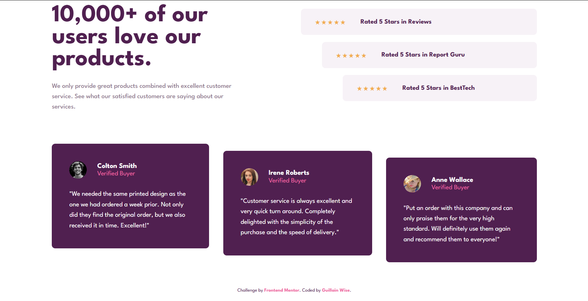

# Frontend Mentor - Social proof section solution

This is my solution to the [Social proof section challenge on Frontend Mentor](https://www.frontendmentor.io/challenges/social-proof-section-6e0qTv_bA).

## Table of contents

- [Overview](#overview)
  - [The challenge](#the-challenge)
  - [Screenshot](#screenshot)
  - [Links](#links)
- [My process](#my-process)
  - [Built with](#built-with)
  - [What I learned](#what-i-learned)
  - [Continued development](#continued-development)
  - [AI Collaboration](#ai-collaboration)
- [Author](#author)
- [Acknowledgments](#acknowledgments)

## Overview

This code creates a responsive social proof section that leverages semantic HTML5 elements like <section>, <article>, and <blockquote> to ensure accessibility and clear content hierarchy. The layout is achieved using CSS Flexbox, employing a "staircase" effect where elements are progressively offset using: nth-child selectors—specifically shifting the rating bars horizontally with margin-left and the testimonial cards vertically with margin-top. To ensure the design remains functional on all devices, a media query removes these offsets on smaller screens, stacking the components into a single, centered column for better readability on mobile.

### The challenge

The goal of this project was to faithfully reproduce a "social proof" section (customer reviews and overall ratings) while ensuring the design is responsive and adapts perfectly to mobile and desktop screens.

Users should be able to:
- View the optimal layout for the section depending on their device's screen size.
- Observe the specific "staggered" layout effects on the rating cards and testimonials.

### Screenshot



### Links

- Solution URL: [Add solution URL here]()
- Live Site URL: [Add live site URL here]()

## My process

### Built with

- Semantic HTML5 markup (`<main>`, `<section>`, `<header>`, `<article>`, `<blockquote>`)
- CSS custom properties (Variables for the color palette)
- **Flexbox** for aligning header elements and cards.
- **CSS Grid** for global positioning of the main container.
- **Mobile-first** approach to ensure a smooth smartphone experience.

### What I learned

This project allowed me to perfect the use of the `:nth-child()` selector to create elegant staggered visual effects without adding unnecessary CSS classes to my HTML.

For example, here is how I handled the progressive offset of the rating cards:

```css
/* Horizontal offset for rating cards */
.rating-card:nth-child(2) { margin-left: 3rem; }
.rating-card:nth-child(3) { margin-left: 6rem; }

/* Vertical offset for testimonials */
.testimonial:nth-child(2) { margin-top: 1rem; }
.testimonial:nth-child(3) { margin-top: 2rem; }
```

I also learned how to structure media queries so that the transition between mobile and desktop views is natural, particularly by reversing `flex-direction` and resetting offsets.

### Continued development

In future projects, I want to further explore:
- Accessibility (Aria-labels for rating stars).
- Image optimization for faster loading times.
- Using methodologies like BEM for naming my classes.

### AI Collaboration

I collaborated with an AI assistant (**Antigravity**) to:
- Analyze my technical choices (Flexbox vs Grid).
- Verify the semantics of my HTML code.

## Author

- Frontend Mentor - [@guillainwise-glitch](https://www.frontendmentor.io/profile/guillainwise-glitch)
- Twitter - [@GuillainWi84543](https://x.com/GuillainWi84543)

## Acknowledgments

Huge thanks to Frontend Mentor for this stimulating challenge that provides great practice for complex CSS layouts!
